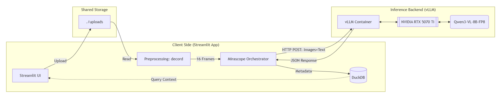
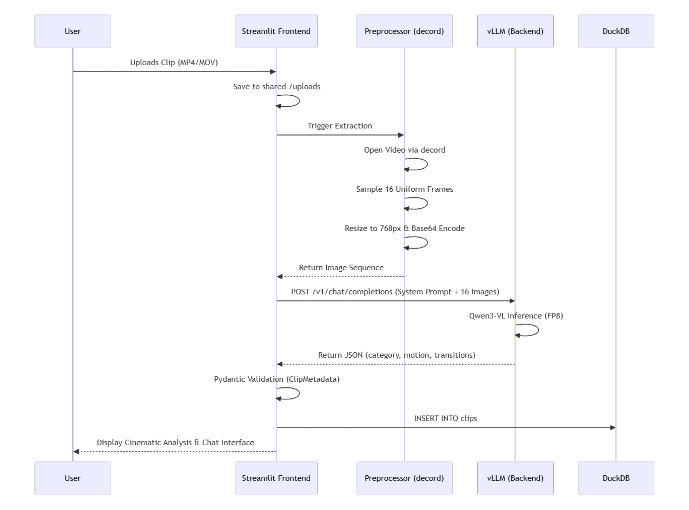

# Framewright: AI Video Editor Assistant

Framewright is a "Cinematic Brainstorming" tool that analyzes video clips using multimodal LLMs (Qwen2-VL via vLLM) to generate shot lists, edit plans, and detailed visual metadata.

## 🚀 Quick Start (Docker)

This project is designed to run entirely within Docker containers, orchestrating a Streamlit frontend and a vLLM inference backend.

### Prerequisites
1.  **OS**: Windows (WSL2) or Linux.
2.  **GPU**: NVIDIA GPU with >= 12GB VRAM (Tested on RTX 5070 Ti 16GB).
3.  **Docker**: Desktop installed with WSL2 backend.
4.  **Drivers**: NVIDIA Container Toolkit must be installed (usually included with Docker Desktop on Windows).

### 1. Environment Setup
Create a `.env` file in the root directory (optional, or export variables):
```bash
# Required for Q&A comparison (optional if only using local Brainstorming)
# Required for Q&A comparison (optional if only using local Brainstorming)
GOOGLE_API_KEY=your_key_here
# Note: Full integration for external API-based models (Gemini, OpenAI) is pending.

```

### 2. Launch the Stack
Run the application using Docker Compose. This starts both the `app` (frontend) and `vllm` (backend).
```bash
docker compose up -d
```
*   **First Run**: This will take time to download the model (`Qwen/Qwen3-VL-8B-Instruct-FP8`) and build the containers.
*   **Access**: Open your browser to `http://localhost:8501`.

### 3. Usage
*   **Upload**: Drop a video file into the UI.
*   **Analyze**: Go to "Cinematic Brainstorming" to get automatic scene breakdown, camera motion analysis, and transition suggestions.
*   **Q&A**: Ask specific questions about the footage.

---

## 🛠️ Architecture & Configuration

*   **Frontend**: Streamlit app (`app/`)
*   **Backend**: vLLM Server (`vllm/`) running `Qwen2-VL-7B-Instruct-FP8`.
*   **Database**: DuckDB (`clips.duckdb`) stores analysis metadata.
*   **Logs**: Centralized logging in `./logs/`.

### System Diagrams



### Logging
Logs from both services are combined into date-stamped files:
```bash
# View live logs
tail -f logs/MM_DD_YYYY_debug.log
```
You can also inspect container logs specifically:
```bash
docker compose logs -f vllm
docker compose logs -f app
```

### Configuration (vLLM)
The vLLM server settings are defined in `vllm/start_server.py`.
*   **Max Model Len**: `8192` (Tunable based on VRAM).
*   **GPU Utilization**: `0.85` (Safety buffer for Windows desktop usage).

---

## 🔧 Troubleshooting

### GPU Out of Memory (OOM)
If the vLLM container exits with code 1 or "Engine core initialization failed":
1.  **Check Background Usage**: Ensure no other AI apps or games are running.
2.  **Adjust Settings**: Edit `vllm/start_server.py` and lower `--gpu-memory-utilization` (e.g., to `0.80`).
3.  **Restart**:
    ```bash
    docker compose restart vllm
    ```

### Missing Dependencies / Code Updates
If you change python dependencies:
```bash
docker compose up --build -d
```

### Resetting the Database
If `clips.duckdb` becomes corrupted (e.g., "WAL file" error):
1.  Stop the app: `docker compose down`
2.  Delete the WAL file: `rm clips.duckdb.wal`
3.  Restart: `docker compose up -d`
