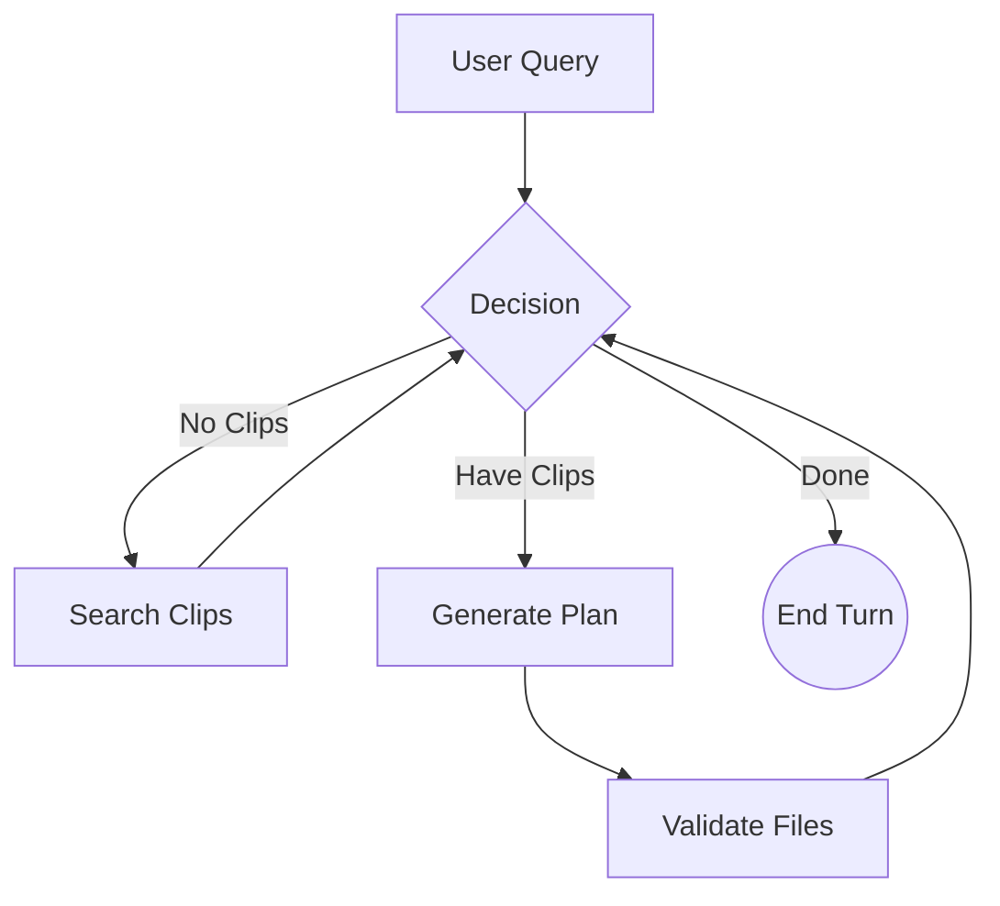

# Video Editor Framewright: Project & Agent Logic Analysis

## 1. Project Overview
**Video Editor Framewright** is an AI-powered application designed to assist with video editing tasks, specifically "Cinematic Brainstorming". It allows users to upload videos, which are then analyzed and stored. Users can then query the system to find specific clips and generate narrative edits.

### Key Components
-   **Frontend (`app/`)**: Built with **Streamlit**, providing the user interface for video upload, chat, and results display.
-   **Backend (`vllm/`)**: Hosting a **vLLM** container for high-performance inference, likely using a Vision-Language Model (VLM) like Qwen2-VL to analyze video frames.
-   **Agent Layer (`app/agent/`)**: The "Brain" of the application, utilizing **LangGraph** for state management and **DSPy** for narrative planning.
-   **Database**: **DuckDB** (`clips.duckdb`) stores metadata about video clips (visual descriptions, categories, etc.) for fast SQL querying.

## 2. Agentic Reasoning Logic (Query to Response)

The agent's logic is defined as a graph in `app/agent/graph.py`. It follows a structured "Plan-and-Execute" style workflow.

### The Flow: Step-by-Step

1.  **User Query (Start)**
    -   The user enters a request (e.g., "Find happy moments and create a montage").
    -   This input is captured in the `FilmState` as `user_intent` and added to `messages`.

2.  **Decision Node (`agent_node`)**
    -   **Input**: Current state (`messages`, `user_intent`, `bin`).
    -   **Logic**:
        -   **New Intent?** If the `bin` (search results) is `None`, the agent decides to **Search**.
        -   **Empty Results?** If `bin` is empty (after a search), it reports failure and **Ends**.
        -   **Have Clips?** If `bin` contains clips, it decides to **Plan** (Reasoning: "I have the ingredients, now I cook").
        -   **Already Responded?** If the last message was from the AI, it marks the turn as **Done**.

3.  **Search Node (`search_node`)**
    -   **Triggered by**: `agent_node` returning `next="search"`.
    -   **Logic**:
        -   Extracts keywords from `user_intent` (e.g., "happy", "montage").
        -   Constructs a SQL query based on these keywords.
        -   Executes the query against the `clips` table in DuckDB using `sql_search`.
        -   **Output**: Updates the `bin` in the state with the found clip records.

4.  **Planner Node (`planner_node`)**
    -   **Triggered by**: `agent_node` returning `next="planner"`.
    -   **Logic**:
        -   Takes `user_intent` and `bin` (search results).
        -   Uses the **DSPy** module `NarrativePlanner` (`app/agent/planner.py`).
        -   **DSPy Logic**: The LLM acts as a creative editor, selecting clips from the bin that fit the narrative goal and ordering them logically. It generates a "Chain of Thought" reasoning and the final `edit_plan`.
        -   **Output**:
            -   Updates `timeline` with the structured plan.
            -   Adds an **AIMessage** to the conversation containing the plan text and reasoning.

5.  **Validation Node (`validation_node`)**
    -   **Triggered by**: Completion of `planner_node`.
    -   **Logic**: Checks if the selected clips actually exist on disk (currently a simplified step).
    -   **Output**: Passes state back to `agent_node`.

6.  **Completion**
    -   Control returns to `agent_node`.
    -   The agent sees the last message is an AIMessage (the plan generated by the planner).
    -   It returns `next="end"`, signifying the interaction is complete for this turn.
    -   The user sees the "I found X clips..." message (from step 2) and the final Edit Plan (from step 4).

### Visual Summary

### Key Technologies in Reasoning
-   **LangGraph**: Orchestrates the loop (Agent -> Search -> Agent -> Plan -> Agent).
-   **DuckDB**: Enables semantic/keyword search over video content.
-   **DSPy**: Handles the complex "Reasoning" task of turning a pile of clips into a coherent story structure, optimizing the prompt and context automatically.
